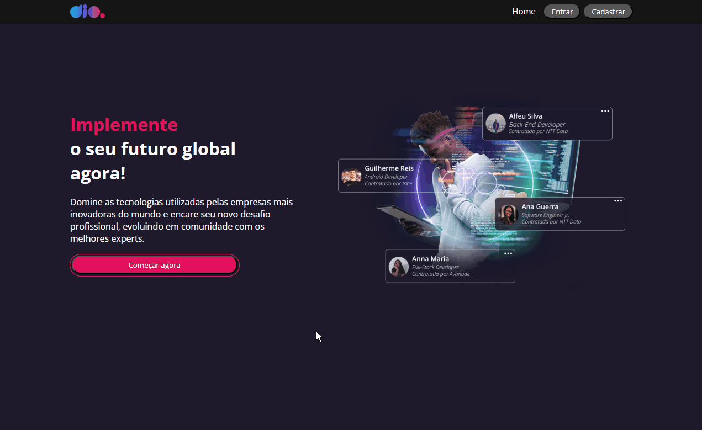
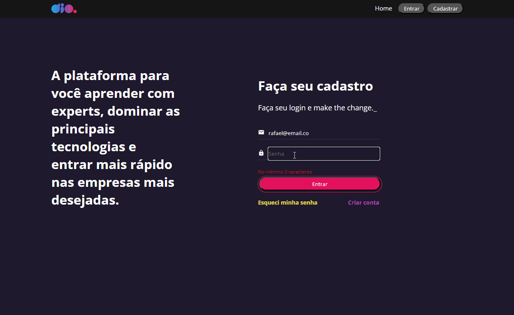
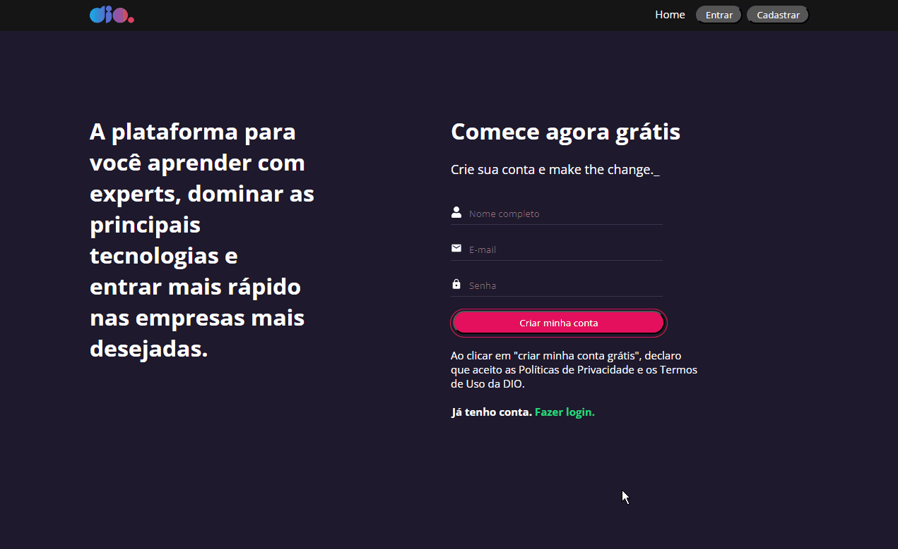
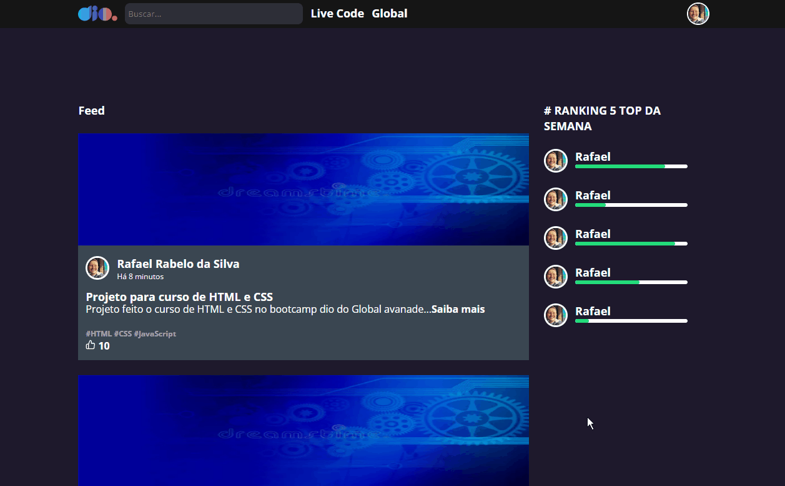

# O Projeto ✨

Este projeto foi desenvolvido como atividade do curso **Formação React Developer** da plataforma DIO. O objetivo do projeto foi criar páginas com roteamentos, criar componentes em React e utilizar o styled-components para estilização. A extensão dos arquivos utilizados no projeto é JSX, que é uma extensão usada para arquivos JavaScript que contêm código em XML.

## Telas

### Home

Na página inicial, o usuário pode visualizar uma mensagem do site juntamente com uma foto ilustrativa. Abaixo da mensagem, há um botão que leva o usuário para a tela de login.

Rota: `http://localhost:3000/`

### Página de Login

Nesta tela, o usuário pode informar os dados contidos no arquivo "db.json" para acessar a tela de feed. Caso as informações de login estejam incorretas, uma mensagem de erro será abaixo do input. O roteamento da aplicação foi feito utilizando a biblioteca react-router-dom.

Rota: `http://localhost:3000/login`

### Página de Cadastro

Essa tela é apenas uma representação estática, onde o usuário precisa informar seus dados e submeter o formulário para realizar o cadastro. A funcionalidade de cadastro em si não foi implementada.

Rota: `http://localhost:3000/signin`

### Feed

Nesta tela, o usuário tem acesso a um feed de publicações, todas elas codificadas diretamente no código, pois não há integração com um banco de dados. Além disso, é possível visualizar um ranking semanal fictício, que é atualizado de acordo com os valores informados no componente `<UserInfo percentual={80}>`.

Rota: `http://localhost:3000/feed`

## Como executar o projeto 🧙‍♂️

Certifique-se de ter as seguintes dependências instaladas antes de prosseguir:

- Node.js (versão 18.15.0)

1. Clone este repositório
2. Instale as dependências usando o comando `npm install` ou `yarn install`
3. Execute o comando `npm start` ou `yarn start` para iniciar o aplicativo
4. Acesse o aplicativo em seu navegador através da URL `http://localhost:3000`

## Dependências ⚙️

- **@hookform/resolvers**: Biblioteca de resolução de formulários para o React Hook Form.
- **@testing-library/jest-dom**: Biblioteca de extensões para testes com o Jest.
- **@testing-library/react**: Biblioteca para testes de componentes React.
- **@testing-library/user-event**: Biblioteca que fornece uma API de eventos de usuário para testes de componentes React.
- **axios**: Biblioteca para fazer requisições HTTP.
- **react**: Biblioteca principal do React.
- **react-dom**: Pacote de integração do React para manipulação do DOM.
- **react-hook-form**: Biblioteca para lidar com formulários no React.
- **react-icons**: Biblioteca de ícones para React.
- **react-router-dom**: Biblioteca para roteamento no React.
- **react-scripts**: Conjunto de scripts para desenvolvimento e construção de aplicativos React.
- **styled-components**: Biblioteca para estilização de componentes React usando CSS no JavaScript.
- **web-vitals**: Biblioteca para medir e relatar as métricas de desempenho da web.
- **yup**: Biblioteca para validação de esquemas.

Espero que essas informações sejam úteis para entender e utilizar o projeto finalizado.

## Contato 👨‍💻

Para mais informações, entre em contato pelo meu [LinkedIn](https://www.linkedin.com/in/rafaelrabelodasilva/)